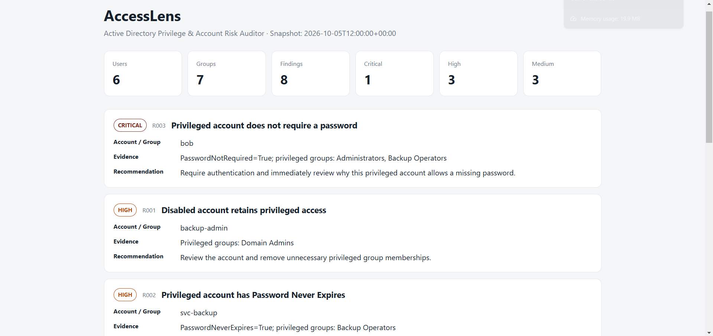
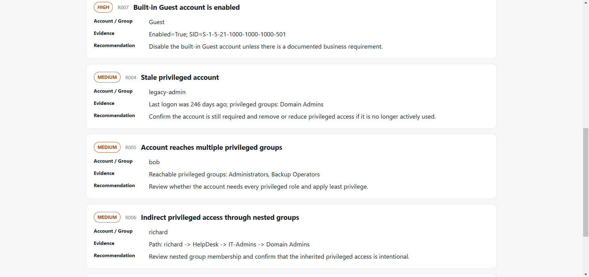
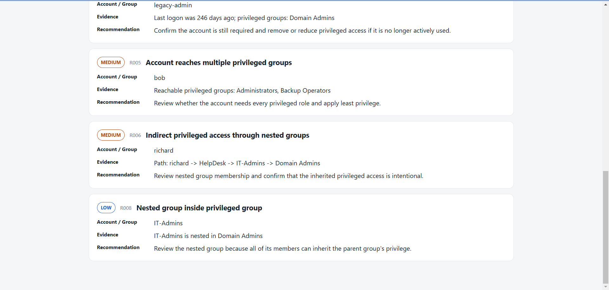

# AccessLens

AccessLens is a small Active Directory auditing project I built to look for risky privileged-account settings and group relationships.

The main goal was to keep the project focused: load an AD snapshot, check a handful of account/security conditions, follow nested group membership, and put the results into a readable HTML report.

## What it checks

AccessLens currently looks for:

- disabled accounts that still have privileged access
- privileged accounts with `PasswordNeverExpires`
- privileged accounts with `PasswordNotRequired`
- privileged accounts that have been inactive for a while
- accounts that can reach multiple privileged groups
- indirect access through nested groups
- an enabled built-in Guest account
- groups nested directly inside privileged groups

The default privileged groups are:

- Domain Admins
- Enterprise Admins
- Schema Admins
- Administrators
- Backup Operators

## How it works

```text
AD / sample data
      |
      v
JSON snapshot
      |
      v
Python checks
      |
      +--> account settings
      +--> privileged group membership
      +--> nested group paths
      |
      v
HTML report
```

For nested groups, I keep the direct membership relationships instead of flattening them. That lets the report show a path such as:

```text
richard -> HelpDesk -> IT-Admins -> Domain Admins
```

## Project files

```text
main.py                 runs the audit
data/sample_ad.json     sample data for testing without a live domain
src/loader.py           loads the JSON snapshot
src/privilege.py        follows group membership paths
src/rules.py            contains the eight audit checks
src/report.py           creates the HTML report
templates/report.html   report layout
collectors/export_ad.ps1 optional AD data collector
tests/test_rules.py     basic rule tests
```

## Run the sample

Create and activate a virtual environment:

```powershell
python -m venv .venv
.venv\Scripts\Activate.ps1
```

Install the dependency:

```powershell
python -m pip install -r requirements.txt
```

Run AccessLens:

```powershell
python main.py --input data/sample_ad.json
```

Then open:

```text
reports/accesslens_report.html
```

## Run the tests

```powershell
python -m unittest discover -s tests -v
```

## Optional AD collection

The PowerShell collector is only needed if I want to pull data from an AD environment I am allowed to access. The sample JSON is enough to run the project without one.

```powershell
powershell -ExecutionPolicy Bypass -File collectors\export_ad.ps1
python main.py --input data/current_ad.json
```

The collector reads users, account settings, groups, and direct group memberships. It does not make changes to AD.

## Scope / limitations

This project is intentionally limited to account properties and group membership. It does not try to cover AD ACLs, Kerberos attack paths, delegation, trusts, AD CS, or exploitation.

The severity levels and the default 90-day stale-account threshold are choices I made for this project so the findings can be prioritized. They are not meant to be universal security standards.

## Demo



